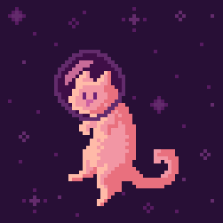
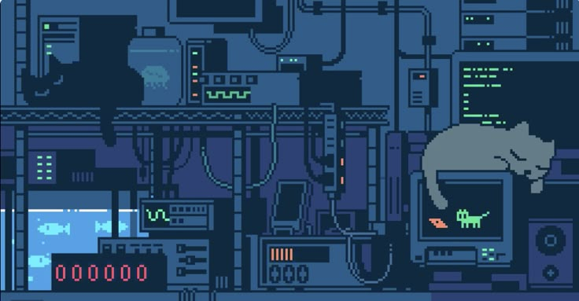
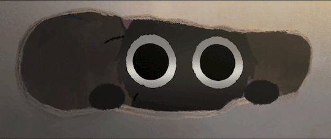

  

<h1 align="center">Hi, I'm Ander!</h1>

  💻 I'm a backend developer in progress, always learning and building cool things.

 

  <h2>My Comprehensive Tech Stack</h2>

  <table border="0">
    <tr>
      <td align="center">
         
        
          

        <h3>🔷 Programming Languages</h3>
        

          
        

         
        
        <h3>🔷 Frameworks & Libraries</h3>
        

          
        

         
        
        <h3>🔷 Databases</h3>
        

          
        

         
        
        <h3>🔷 Tools & Cloud</h3>
        

          
        

         
        
        <h3>🎯 Currently Learning</h3>
        

          
        

          

        
          
      </td>
    </tr>
  </table>

